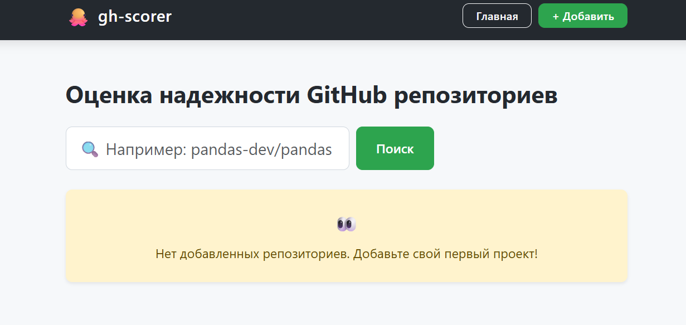
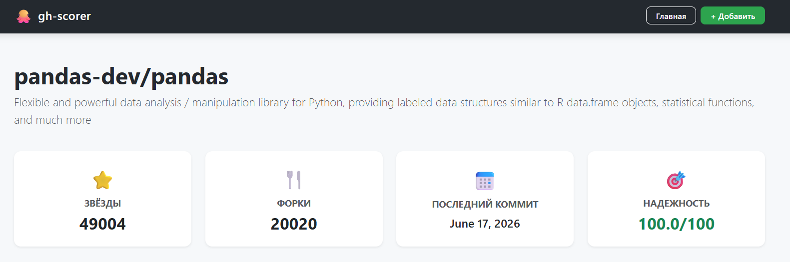
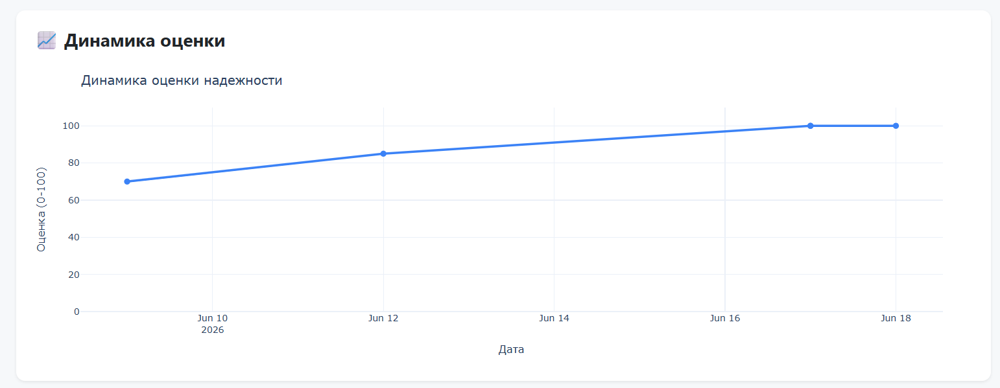
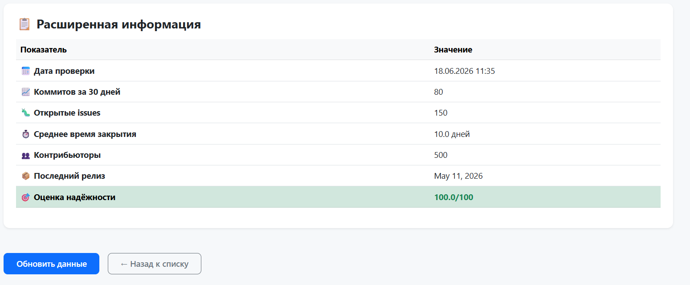
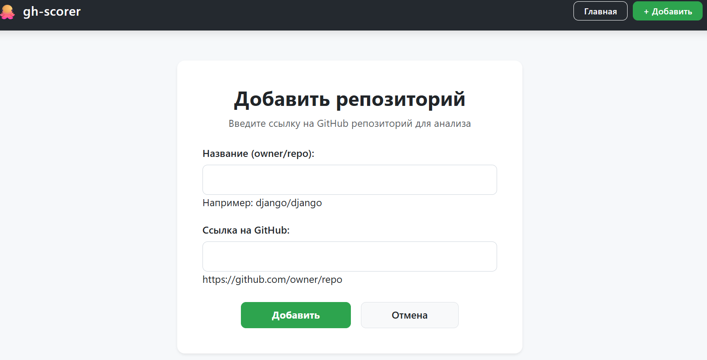

# gh-scorer

Сервис для оценки надежности Open Source библиотек на GitHub. Помогает разработчикам принимать решение об использовании библиотеки, анализируя активность репозитория, скорость реакции на issues и актуальность релизов.

**Ссылка на рабочий проект:** [https://ekuprianovaghskorer.pythonanywhere.com](https://ekuprianovaghskorer.pythonanywhere.com)


## Технологии

* **Python 3.10**
* **Django 6.0.5**
* **GitHub REST API** — получение данных о репозиториях
* **Plotly 5.18.0** — интерактивные графики
* **Bootstrap 5.3** — адаптивный интерфейс
* **SQLite3** — база данных


## Скриншоты

### Главная страница

*Список репозиториев с оценками надежности и поиск*

### Детальная страница — информация

*Основные метрики: звёзды, форки, коммиты, оценка*

### Детальная страница — график

*Интерактивный график изменения оценки надежности*

### Детальная страница — таблица

*Таблица с детальными данными и кнопки управления*

### Форма добавления

*Добавление репозитория по ссылке с автоматическим получением данных из GitHub*


## Как запустить проект локально

1. **Клонируйте репозиторий:**
   ```bash
   git clone https://github.com/ekuprianova18-wq/gh-scorer.git
   cd gh-scorer
   ```

2. **Создайте и активируйте виртуальное окружение:**
   ```bash
   python -m venv venv
   source venv/bin/activate  # для Linux/Mac
   venv\Scripts\activate     # для Windows
   ```

3. **Установите зависимости:**
   ```bash
   pip install -r requirements.txt
   ```

4. **Создайте файл `.env` в корне проекта и добавьте переменные:**
   ```env
   SECRET_KEY=ваш-секретный-ключ
   GITHUB_TOKEN=ваш-токен-от-github
   ```

5. **Выполните миграции:**
   ```bash
   python manage.py migrate
   ```

6. **Создайте суперпользователя:**
   ```bash
   python manage.py createsuperuser
   ```

7. **Запустите сервер:**
   ```bash
   python manage.py runserver
   ```

8. **Откройте проект в браузере:**
   Перейдите по ссылке: http://127.0.0.1:8000/


## Как обновить данные из GitHub

Для получения актуальных данных о репозиториях выполните команду:

```bash
python manage.py update_repos
```


## Функционал

* **Главная страница** — список репозиториев с оценками и поиск
* **Добавление репозитория** — по ссылке из GitHub, данные подтягиваются автоматически
* **Детальная страница** — информация, интерактивный график динамики и таблица с расширенными данными
* **Обновление данных** — кнопка на детальной странице для получения свежих данных из GitHub API
* **Админ-панель** — управление репозиториями, снимками и оценками


## Формула оценки надежности

Оценка рассчитывается по шкале **от 0 до 100** на основе четырёх факторов:

| Фактор | Вес | Описание |
|--------|-----|----------|
| Активность коммитов | 40% | Количество коммитов за последние 30 дней |
| Скорость закрытия issues | 30% | Среднее время закрытия issues |
| Свежесть релизов | 20% | Давность последнего релиза |
| Популярность | 10% | Количество звёзд на GitHub |


## Автор

**Екатерина Куприянова**